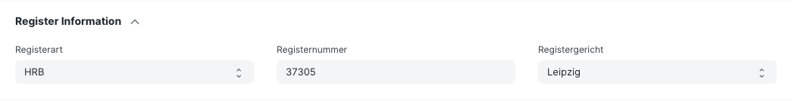

## ERPNext Germany

App to hold regional code for Germany, built on top of ERPNext.

### Features

- German accounting reports

    - _Summen- und Saldenliste_
    - _Zusammenfassende Meldung_
    - _Kontoblatt_ (account sheet with a running balance)
    - _Betriebswirtschaftliche Auswertung_ (BWA, per a configurable scheme)
    - _Prüfliste Monatsabschluss_ (month-end checklist, incl. VAT verification)
    - _Belegnummernkreise_ (gap check over document ranges)

- **Bookkeeping** the way a German accountant works (dt. Buchführung nach DATEV)

    A separate module for entering and posting bookkeeping data in the terms and
    the workflow a DATEV user knows.

    - **Posting Batch** (_Buchungsstapel_) — collect entries and post them to the
      ledger in one transaction. One line is one complete entry: account, contra
      account, amount, side. A target amount and a running difference make the
      batch reconcilable against a bank statement or an adding-machine tape.
      Lines can name a party and settle one of its open items.
    - **Fast Entry** (_Buchungsmaske_) — the DATEV entry mask: one line, the
      familiar tab order and column names, no mouse. Accounts, tax keys, parties
      and open items are resolved in the browser, so nothing waits for the
      server; the balance of both accounts is shown while typing.
    - **Tax Key** (_BU-Schlüssel_) — derive net, tax and tax account from the
      account, including reverse charge under § 13b UStG. Accounts carrying a
      tax key are flagged as _Automatikkonten_.
    - **Ledger Lockdown** (_Festschreibung_) — close a period per § 146 Abs. 4
      AO. Hooked on **GL Entry**, so every route into a closed period is covered,
      including the reversal a cancellation produces.
    - **General reversal** (_Generalumkehr_) — the German way to correct a posted
      entry, with a mandatory reason.
    - **Document Range** (_Belegkreis_) — consecutive document numbers per range,
      checked for gaps.
    - **Booking Text Shortcut** (_Buchungstextkonstante_) — short codes that
      expand into a booking text while typing.
    - **GoBD export** — what a Betriebsprüfer asks for: the data as files,
      together with an index describing every column, per the
      _Beschreibungsstandard_ (GDPdU DTD of 2004).

- Section for Register Information (Registerart, -gericht und nummer) in **Company**, **Customer** and **Supplier**

    

- Validation of EU VAT IDs

    Automatically checks the validity of EU VAT IDs of all your customers every three months, or manually whenever you want. Check out the [intro on Youtube](https://youtu.be/hsFMn2Y85zA) (german).

    

- Allow deletion of the most recent sales transaction (per naming series and company) only

    This ensures consecutive numbering of transactions. Applies to **Quotation**, **Sales Order**, **Sales Invoice**.

- Restrict deletion of attachments to submitted transactions
- Custom fields in **Employee** (tax information, etc.)
- List of religios denominations ("Konfessionen")
- List of German health insurance providers (depends on HRMS)
- Create **Business Letters** from a template and print or email them to your customers or suppliers
- Record **Business Trips** and pay out allowances to your employees (dt. Reisekostenabrechnung) (depends on HRMS)

## Installation

> [!NOTE]
> Some features of this app depend on the [HRMS](https://github.com/frappe/hrms) app. If you want to use them, you need to install the HRMS app before installing this app.

### On Frappe Cloud

You can find ERPNext Germany in the [Frappe Cloud Marketplace](https://frappecloud.com/marketplace/apps/erpnext_germany).
Please refer to the [Frappe Cloud documentation](https://frappecloud.com/docs/installing-an-app) on how to install an app.

### Local

Using bench, [install ERPNext](https://github.com/frappe/bench#installation) as mentioned here.

Once ERPNext is installed, add the ERPNext Germany app to your bench by running

```bash
bench get-app https://github.com/alyf-de/erpnext_germany.git
```

After that, you can install the app on required site (let's say demo.com ) by running

```bash
bench --site demo.com install-app erpnext_germany
```

## Business Trip

Before an employee can create a **Business Trip (Dienstreise)**, you should configure the available regions and their travel allowances in the **Business Trip Region** list. A basic list based on the German tax law is imported on installation, but not further updated later. In the **Business Trip Settings (Dienstreise-Einstellungen)** you can set the value for the mileage allowance and select **Expense Claim Type** for mileage allowance and **Additional meal expenses**. Both Expense Claim Type are preset to **Additional meal expenses**. If you have HRMS installed, it allows you to book expenses as Expense Claims.

When a **Business Trip** is submitted, it creates a draft **Expense Claim** for the employee's travel allowances including the Additional meal expenses as well as mileage allowance for "Car (private)". One business trip will create on **Expense Claim** which can be approved and submitted as usual.

Mileage allowance is calculated based on the distance entered in the details of the journey when "Car (private)" is selected.

The Additional meal expenses depend on the selected region. Select the "From" and "To" dates of the trip and with the click on "Add Row" all days of the trip a pre-created.

The receipts for transport and accommodation can be attached, but are not processed automatically. You can check them, create a **Purchase Invoice** and pay the respective amount to the employee.

You can use our [Banking app](https://github.com/alyf-de/banking) to reconcile the **Expense Claims** and **Purchase Invoices** with the respective **Bank Transactions**.

## Zusammenfassende Meldung

Currently, this report lists all invoices as other service ("S"). If you do triangular transactions ("D") or intra-Community supplies ("L"), you need to manually adjust this column in the CSV file. Automatically determining the service type is planned for a future version.

## Quick Start Demo

The fastest way to get a running demo site on your local desktop.

Prerequisites: [Docker](https://www.docker.com/) and [git](https://git-scm.com/) installed on your machine.

```bash
git clone https://github.com/alyf-de/erpnext_germany.git
cd erpnext_germany/docker
cp .env.example .env
docker compose up -d
```

The first setup will take a while. Then you can access the demo site at http://localhost:8000.
Log in with the Username `Administrator` and the default password `admin`.

Read more about the setup in the [docker/README.md](docker/README.md) file.

### License

GNU GPL V3. See the `LICENSE` file for more information.
