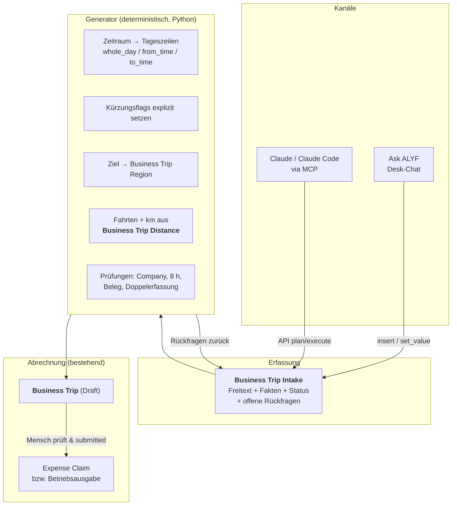

# KI-gestützte Reisekostenabrechnung — Konzept für diesen Fork

**Stand 13.08.2026 · Fork von `alyf-de/erpnext_germany`, Basis `version-15` · Zielsystem axessio.de (Frappe Cloud v15)**

Ziel: Ein Satz wie

> „Erstelle die Spesenabrechnung für meine Fahrt von heute morgen 8 Uhr bis 17 Uhr nach
> Baden-Baden wegen Bauvorhaben Baden-Baden."

erzeugt — nach gezielten Rückfragen — eine vollständige, steuerlich anerkennungsfähige
Reisekostenabrechnung. Bedienbar über **Ask ALYF** (Chat im Desk) **und** über **Claude**
(MCP / Claude Code), mit identischem Ergebnis.

---

## 1. Warum ein Fork und kein neues Modul

Diese App enthält mit **Business Trip** bereits die vollständige deutsche
Reisekostensystematik: Verpflegungspauschalen nach § 9 Abs. 4a EStG, Kürzung 20/40/40 % bei
gestellten Mahlzeiten, 8-Stunden-Regel, Kilometerpauschale (nur Privat-Pkw), Übernachtungen,
sonstige Kosten mit Belegen — und beim Submit einen Expense Claim. Die BMF-Sätze inklusive der
Auslandswerte ab 01.01.2026 sind gepflegt.

Ein separates Modul müsste diese Logik entweder duplizieren oder von außen umbauen. Beides ist
teurer und schlechter zu warten als die Erweiterung an Ort und Stelle. Deshalb:

* **Alles, was Fachlogik ist, entsteht hier im Fork** — im Modul `ERPNext Germany`, neben den
  bestehenden Business-Trip-DocTypes, im selben Stil (Tabs, ruff, `FrappeTestCase`).
* **Der Fork bleibt rebasefähig.** Änderungen an bestehenden Dateien bleiben minimal und
  klar abgegrenzt; Neues kommt in eigene Dateien. So bleibt `git rebase upstream/version-15`
  eine Routineübung statt eines Merge-Dramas.
* **Was allgemein nützlich ist, geht als Pull Request zurück** an `alyf-de/erpnext_germany`
  (Entfernungstabelle, Tagesableitung, Print Format). Was axessio-spezifisch ist (Anbindung
  ans Automation Run Log, Mandantenregeln), bleibt im Fork.
* **Ein Fork von `ask_alyf` wird nur bei Bedarf gezogen** — siehe Abschnitt 6.

Branch-Strategie: `version-15` als Basis (Produktivsystem läuft v15), Feature-Branches
`feature/reisekosten-*`, regelmäßiger Rebase auf `upstream/version-15`.

---

## 2. Ausgangslage im Zielsystem (geprüft am 13.08.2026)

| Befund | Bedeutung |
|---|---|
| 0 Business Trips, 0 Expense Claims | Grüne Wiese, keine Migration — aber auch keine erprobte Buchungsstrecke |
| **Business Trip Settings leer**: `mileage_allowance` = 0,00 €, kein Expense Claim Type | **Jeder Submit bricht heute ab** — der Fallback greift auf den Typ „Additional meal expenses", den es nicht gibt |
| Expense Claim Types nur `Calls, Food, Medical, Others, Travel` | Keine Trennung Verpflegung / Kilometergeld, keine passenden Konten |
| Region „Deutschland" 28,00 / 14,00 € ab 2024 | Für 2026 korrekt — die im Wachstumschancengesetz diskutierte Anhebung auf 32/16 € ist nie Gesetz geworden |
| 17 Companies, Mitarbeiter „Alexander Finkeißen" nur bei *axessio Unternehmensgruppe* | Mandantenzuordnung ist eine echte Rückfrage, kein Detail |
| `expense_approver` am Mitarbeiter nicht gesetzt | Freigabekette ungetestet |
| Ask ALYF: Agent Mode an, Modell `claude-sonnet-4-6`, Vision an | Kanal 1 einsatzbereit |
| Frappe Assistant Core (MCP) installiert | Kanal 2 einsatzbereit |

### Zwei Fallstricke, die das Design bestimmen

1. **Feld-Defaults der Tageszeilen**: `breakfast_was_provided` = 1 und
   `accommodation_was_provided` = 1. Wer eine Zeile anlegt, ohne diese Flags bewusst zu setzen,
   verliert stillschweigend 20 % des Ganztagssatzes (5,60 €). **Ein Generator darf die Defaults
   niemals übernehmen, sondern setzt alle vier Flags explizit.**
2. **Ask ALYF kann keine `/api/method`-Server-Skripte vom Backend aufrufen.** Eine Lösung, die
   allein auf einem Endpoint beruht, wäre im Desk-Chat nicht bedienbar. Deshalb ist der
   Eintrittspunkt ein DocType (Abschnitt 4.2).

---

## 3. Steuerlicher Rahmen (Arbeitsgrundlage, keine Steuerberatung)

* **Inland 2026: 28,00 € ganztägig, 14,00 € bei An-/Abreise oder > 8 h Abwesenheit.**
  Eintägig ≤ 8 h: kein Verpflegungsmehraufwand.
* **Kürzung** bei gestellten Mahlzeiten: 20 % Frühstück, 40 % Mittag, 40 % Abendessen —
  jeweils vom Ganztagssatz (5,60 € / 11,20 € / 11,20 €).
* **0,30 €/km** nur bei Nutzung des **privaten** Fahrzeugs. Firmenwagen → kein Kilometergeld.
* **Aufzeichnungspflichtig je Reise:** Anlass, Datum, Abfahrts- und Rückkehrzeit, Reiseweg,
  Verkehrsmittel, Kilometer, gestellte Mahlzeiten, Übernachtungen, Belege, Freigabe.
* **Übernachtung:** Im Inland keine Pauschale, nur tatsächliche Kosten mit Beleg (die Region
  „Deutschland" hat folgerichtig `accommodation = 0,00 €`). Im **Ausland** ist die
  Übernachtungspauschale für die steuerfreie Arbeitgebererstattung zulässig, für den
  **Betriebsausgabenabzug des Unternehmers dagegen nicht** — daraus folgt Abschnitt 5.
* **GoBD:** Der submittete Business Trip ist unveränderbar (docstatus 1, Versionshistorie),
  Belege hängen als File am Dokument, Korrekturen laufen über Cancel + Amend.

### Rechenbeispiel der Beispielfahrt

| Position | Grundlage | Betrag |
|---|---|---|
| Verpflegung 13.08.2026, 08:00–17:00 (9 h, eintägig, keine Mahlzeit gestellt) | Region Deutschland, `arrival_or_departure` | **14,00 €** |
| Heidelberg → Baden-Baden → Heidelberg, Privat-Pkw, 2 × 90 km | 180 × 0,30 €/km | **54,00 €** |
| **Summe** | | **68,00 €** |

Mit Firmenwagen: 14,00 €. Mit gestelltem Mittagessen: 2,80 € + Fahrtkosten.
Genau diese Verzweigungen begründen die Rückfragen — die KI darf hier nichts raten.

---

## 4. Architektur

### 4.1 Leitsätze

1. **Die KI ermittelt Fakten, der Server rechnet.** Sprachmodelle liefern ausschließlich
   Sachverhalte (Ort, Zeit, Anlass, Verkehrsmittel, Mahlzeiten). Jede Zahl entsteht
   deterministisch in Python aus Regionstabelle, Settings und Entfernungstabelle.
2. **Ein Kern, zwei Kanäle.** Ask ALYF und Claude/MCP rufen dieselbe Funktion auf. Die
   Fachlogik existiert genau einmal. (Kein n8n — die Kanäle sprechen direkt mit ERPNext.)
3. **Nichts wird gebucht, was ein Mensch nicht gesehen hat.** Die Automatik erzeugt Entwürfe,
   der Submit bleibt beim Menschen.
4. **Upstream-nah bauen.** Was der Upstream kann, bleibt Upstream.

### 4.2 Schichten

### 4.3 Der Kniff für „Ask ALYF **und** Claude"

* **Ask ALYF** legt einen Datensatz **Business Trip Intake** an (`insert`, mit Bestätigung).
  Der `validate`-Hook ruft den Generator. Fehlende Angaben landen als Klartextfragen im Feld
  `open_questions`; die KI liest den gespeicherten Datensatz zurück und stellt genau diese
  Fragen. Antworten kommen per `set_value` — es wird neu gerechnet.
* **Claude / MCP** ruft zusätzlich `POST /api/method/…create_business_trip` im
  Plan-/Execute-Muster auf (Plan = Vorschau ohne Schreiben). Der Endpoint erzeugt intern
  denselben Intake-Datensatz und ruft dieselbe Kernfunktion.

Der Fragenkatalog lebt damit **im Server, nicht im Prompt**. Beide Kanäle fragen dasselbe, auch
wenn das Modell wechselt. Die Prompt-Bausteine beschreiben nur die Bedienung, nie die Rechenregeln.

Weil die Erfassung ein eigener Datensatz ist, dürfen Rückfragen tagelang offen bleiben —
die Anforderung „zunächst speichern" ist damit erfüllt.

### 4.4 Business Trip Intake (neuer DocType, geplant)

| Feld | Zweck |
|---|---|
| `raw_input` | Originalsatz des Nutzers — Nachvollziehbarkeit |
| `employee`, `company` | Vorbelegt; Company nur aus den zulässigen (Abschnitt 5) |
| `purpose` | **Anlass** („Bauvorhaben Baden-Baden") — steuerliches Pflichtmerkmal |
| `project` / `customer` | Kostenzuordnung, optional |
| `start_datetime`, `end_datetime` | Grundlage der 8-h-Prüfung |
| `origin`, `destination` | Startort (Default Betriebsstätte) und Ziel |
| `region` | Aufgelöst aus `destination`, Default „Deutschland" |
| `mode_of_transport`, `vehicle_kind` | Privat-Pkw / Firmenwagen / Mietwagen — steuert Kilometergeld |
| `distance` | Vorschlag aus **Business Trip Distance**, sonst Rückfrage |
| `breakfast/lunch/dinner_was_provided` | **Explizit**, nie Default |
| `overnight` + Tabelle | Übernachtungen inkl. Ort und Beleg |
| `other_expenses` | Parkgebühren, Tickets … mit Belegdatei |
| `status` | Entwurf · Rückfragen offen · Bereit · Übernommen · Verworfen |
| `open_questions` | Vom Server erzeugte Rückfragen (JSON + Klartext) |
| `calculation_preview` | Beträge inkl. Herleitung — **vor** dem Anlegen |
| `business_trip` | Ergebnis-Dokument |

### 4.5 Rückfragen-Katalog (serverseitige Regeln)

| Auslöser | Rückfrage | Warum steuerlich nötig |
|---|---|---|
| Mehrere zulässige Gesellschaften oder Anlass deutet auf eine andere | „Für welche Gesellschaft? (Vorschlag: axessio Hotel Baden-Baden GmbH)" | Betriebsausgabe muss dem richtigen Mandanten zugeordnet werden |
| Verkehrsmittel unklar | „Eigenes Auto, Firmenwagen oder Bahn?" | 0,30 €/km nur bei Privat-Pkw |
| Privat-Pkw, Strecke unbekannt | „Wie viele Kilometer einfach?" — entfällt, wenn die Strecke in der Entfernungstabelle steht | Bemessungsgrundlage Fahrtkosten |
| Abwesenheit nahe 8 h | „Wann genau los- und zurückgefahren?" | 8-Stunden-Grenze: 14,00 € oder 0,00 € |
| Mehrtägig ohne Übernachtung | „Hast du übernachtet? Liegt eine Rechnung vor?" | Ganztags- vs. An-/Abreisesatz, Belegpflicht |
| Mahlzeiten unbeantwortet | „Wurde eine Mahlzeit gestellt?" | Kürzung 20/40/40 % |
| Anlass fehlt oder unscharf | „Was war der Anlass?" | Pflichtmerkmal |
| Sonstige Kosten ohne Beleg | „Bitte Beleg fotografieren" | Belegpflicht |
| Tag bereits abgerechnet | „Für den 13.08.2026 existiert bereits BT-0007 — ergänzen oder neu?" | Doppelte Pauschale verhindern |

Regel: **Nie raten.** Fehlt ein Pflichtwert, wird gefragt — einmal und gebündelt. Ist der Wert
ableitbar (Region aus Ziel, Startort aus Betriebsstätte, Kilometer aus der Entfernungstabelle),
gibt es einen **Vorschlag zur Bestätigung** statt einer Leerfrage.

---

## 5. Verbuchung: Arbeitnehmer *und* Unternehmer — je Gesellschaft

Bei 17 Gesellschaften ist die Rolle nicht einheitlich. Der Abrechnungsmodus wird deshalb
**je Company konfiguriert** (Erweiterung der Business Trip Settings um eine Tabelle
„Abrechnungsmodus je Gesellschaft"):

| Modus | Wirkung |
|---|---|
| **Arbeitnehmer-Erstattung** (Default) | Weg wie bisher: Business Trip → Expense Claim → steuerfreie Erstattung an den Mitarbeiter. Übernachtungspauschale im Ausland zulässig. |
| **Unternehmer / Gesellschafter** | Verpflegungspauschale und Kilometergeld als **Betriebsausgabe**; Verrechnung über das Gesellschafterkonto statt über die Personalverbindlichkeit. **Übernachtungspauschale im Ausland wird gesperrt** — nur tatsächliche Kosten mit Beleg. |

Der Generator liest den Modus, bevor er rechnet, und
* blendet im Unternehmer-Modus die Auslands-Übernachtungspauschale aus (Flag
  `accommodation_was_provided` bleibt gesetzt, stattdessen Belegpflicht-Rückfrage),
* wählt Konten und Belegart entsprechend,
* schreibt den verwendeten Modus in die Berechnungsvorschau, damit die Herleitung prüfbar bleibt.

Die konkrete Kontenzuordnung je Gesellschaft ist mit der Buchhaltung abzustimmen (offener Punkt).

---

## 6. Ask ALYF: erst Konfiguration, Fork nur bei Bedarf

Im Zielsystem wird die Wissensbasis aus Performancegründen **inline im System-Prompt** gehalten
(„Rufe das Tool `read_skill` NICHT auf"). Für den ersten Schritt genügt daher:

1. Ein Abschnitt „Reisekosten" im System-Prompt: wann ein Intake angelegt wird, welche Felder
   es gibt, dass Beträge **nie** selbst gerechnet werden, dass `open_questions` vorzulesen sind.
2. Die Werkzeuge `insert` / `set_value` / `attach_file` reichen aus — kein Codeeingriff.

**Ein Fork von `alyf-de/ask_alyf` wird erst nötig, wenn** eine dieser Grenzen erreicht ist:

* ein dediziertes Werkzeug (z. B. `create_business_trip`) soll direkt als Tool angeboten werden,
  statt den Umweg über `insert` zu gehen;
* Rückfragen sollen als strukturierter Dialog erscheinen statt als Chattext;
* Belegfotos sollen automatisch in die richtige Zeile einsortiert werden.

Bis dahin bleibt Ask ALYF unverändert — jeder Fork erzeugt Wartungslast, die er verdienen muss.

---

## 7. Was in diesem Branch bereits gebaut ist: Entfernungstabelle

**DocType `Business Trip Distance`** — hinterlegte Strecken für wiederkehrende Fahrten, z. B.
„Heidelberg, Büro ↔ Baden-Baden (90 km)".

| Feld | Bedeutung |
|---|---|
| `from_location`, `to_location` | Orte, so geschrieben wie in der Fahrt |
| `distance` | **einfache** Strecke in km; Hin- und Rückfahrt sind zwei Zeilen im Business Trip |
| `is_bidirectional` | Strecke gilt auch in Gegenrichtung (Default an) |
| `company` | leer = für alle Gesellschaften; gesetzt = überschreibt die allgemeine Strecke |
| `disabled`, `notes` | Pflege |

Verhalten:

* **Autovervollständigung im Formular:** Sobald in einer Fahrt Start, Ziel und ein Auto-Modus
  stehen und das Kilometerfeld leer ist, wird die hinterlegte Strecke eingetragen — ein von Hand
  eingegebener Wert wird nie überschrieben.
* **Vergleich unempfindlich** gegen Groß-/Kleinschreibung und doppelte Leerzeichen.
* **Duplikatsschutz:** Zwei Zeilen, die dieselbe Fahrt treffen würden, werden abgelehnt — sonst
  wäre der Vorschlag nicht vorhersagbar. Eine gesellschaftsspezifische Strecke darf eine
  allgemeine bewusst überschreiben.
* **Programmatisch:** `get_distance(from_location, to_location, company)` — dieselbe Funktion
  nutzt später der Generator, damit Formular und KI identische Kilometer liefern.

Tests decken Richtung, Groß-/Kleinschreibung, Gesellschaftsvorrang, Duplikate und Deaktivierung ab.

### Fahrzeuge je Mitarbeiter (`Employee Vehicle`)

Wer zwei Privatwagen hat, konnte bisher nur „Car (private)" ankreuzen — welches Auto gefahren
wurde, stand nirgends. Der DocType hält die Fahrzeuge eines Mitarbeiters fest
(`vehicle_name`, `license_plate`, `ownership`, `vehicle_class`, `is_default`), die Fahrt
verweist über `employee_vehicle` auf eines davon.

Die Auswahl ist nicht nur Dokumentation: Der Satz hängt daran. Motorräder und andere
motorbetriebene Fahrzeuge werden mit 0,20 €/km statt 0,30 €/km erstattet
(`Business Trip Settings.mileage_allowance_other_motor_vehicle`; ohne Angabe gilt der Pkw-Satz,
damit bestehende Reisen unverändert rechnen).

Drei Fälle, die stillschweigend falsch abgerechnet hätten, brechen jetzt ab: ein Fahrzeug eines
anderen Mitarbeiters, ein deaktiviertes Fahrzeug, und ein Firmen- oder Mietwagen, für den
„Car (private)" gewählt wurde. Wer nur ein Fahrzeug hat, muss nichts auswählen — es wird
vorgeschlagen. Die Belegzeile im Expense Claim nennt das Fahrzeug statt nur „Privatauto".

### Konfiguration im Zielsystem (bereits angelegt)

| Was | Wert |
|---|---|
| Expense Claim Type `Verpflegungsmehraufwand` | Konto 6664 (Arbeitnehmer) bzw. 6674 (Unternehmer) je Gesellschaft |
| Expense Claim Type `Kilometerpauschale` | Konto 6663 bzw. 6673 je Gesellschaft |
| `Business Trip Settings` | 0,30 €/km, beide Expense Claim Types verknüpft |
| Konto 3720 „Verb. aus Lohn und Gehalt" | `account_type` = Payable (Voraussetzung für den Expense Claim) |
| Company-Vorgabe `default_expense_claim_payable_account` | 3720, für axessio Unternehmensgruppe, Hausverwaltung und Hotel Baden-Baden |
| Mitarbeiter Alexander Finkeißen | `expense_approver` gesetzt |

Bewusst **nicht** gesetzt: das Gegenkonto für die Unternehmer-Gesellschaften
(*Christina Finkeißen Rechtsanwältin*, *MPF Immobilien KG*). Dort gehört die Erstattung nicht auf
ein Lohnkonto, sondern auf ein Privat-/Gesellschafterverrechnungskonto — das ist eine
Entscheidung für den Steuerberater (Abschnitt 10).

---

## 8. Umsetzung in Stufen

**Stufe 0 — Konfiguration (½ Tag, sofort sinnvoll, unabhängig vom Rest)**
Expense Claim Types „Verpflegungsmehraufwand" und „Kilometerpauschale" anlegen (Konten mit der
Buchhaltung abstimmen), Business Trip Settings füllen (`mileage_allowance` = 0,30 €),
`expense_approver` setzen, eine Testreise komplett durchspielen. **Ohne diesen Schritt schlägt
jeder Submit fehl.**

**Stufe 1 — Entfernungstabelle (fertig in diesem Branch)**
Nach dem Deploy: die regelmäßigen Strecken einpflegen (Büro → Baden-Baden usw.).

**Stufe 2 — Intake + Generator (2–4 Tage)**
DocType `Business Trip Intake`, Tagesableitung, explizite Kürzungsflags, Regionsauflösung,
Rückfragen-Katalog, Prüfungen, Berechnungsvorschau, Anbindung ans Automation Run Log.

**Stufe 3 — Kanäle (1–2 Tage)**
Whitelisted API mit Plan/Execute für Claude, Prompt-Baustein für Ask ALYF, End-to-End-Test
„gleicher Satz, gleiches Ergebnis in beiden Kanälen".

**Stufe 4 — Beleg & Druck (1–2 Tage)**
Belegfoto → Vision-Extraktion → Zeile + Anhang; Print Format „Reisekostenabrechnung" mit allen
Pflichtmerkmalen aus Abschnitt 3.

### Akzeptanzkriterien

1. Der Beispielsatz erzeugt ohne Nacharbeit einen korrekten Entwurf (14,00 € + Kilometergeld);
   alles Fehlende wurde erfragt, nichts geraten.
2. Testmatrix grün: eintägig ≤ 8 h / > 8 h, mehrtägig, alle Kürzungskombinationen, Ausland mit
   Gültigkeitswechsel zum 01.01.2026, beide Abrechnungsmodi.
3. Kein Betrag stammt aus einem Sprachmodell — im Run Log nachweisbar.
4. Submit erzeugt einen sauber verbuchten Beleg.
5. Ask ALYF und Claude liefern für dieselbe Eingabe dasselbe Ergebnis.
6. Druckbeleg enthält alle Pflichtmerkmale.

### Einordnung nach axessio-Entwicklungsprozess

Risikoklasse **B** (schreibend, erzeugt Entwürfe; kein direkter Geldfluss) ·
Autonomiestufe **1 — Vorschlagen**, Aufstieg auf 2 frühestens nach 4 Wochen mit ≥ 98 %
Übereinstimmung aus dem Run Log · Automation Rule mit Kill-Switch, verantwortliche Rolle
Buchhalter · Feature-Datensatz vor Baubeginn · Deploy dienstags, davor Dry-Run.

---

## 9. Ablauf der Abrechnung und Auszahlung

### 9.1 Die Kette vom Satz bis zum Geld

| # | Schritt | Wer | Ergebnis |
|---|---|---|---|
| 1 | Reise beschreiben, Rückfragen beantworten | Reisender (Chat oder Formular) | `Business Trip` als **Entwurf**, Beträge vom Server gerechnet |
| 2 | Prüfen und **Submit** | Reisender | Status `Submitted`, Dokument unveränderbar; **automatisch** entsteht ein `Expense Claim` als Entwurf mit je einer Zeile pro Fahrt und pro Tag |
| 3 | Genehmigen | `expense_approver` am Mitarbeiter | `approval_status` = Approved |
| 4 | Expense Claim **Submit** | Buchhaltung | Buchung: Reisekostenkonto (6664 / 6663 bzw. 6674 / 6673) **an** 3720 Verb. aus Lohn und Gehalt, Party = Mitarbeiter |
| 5 | **Auszahlung** | Buchhaltung | Der Saldo auf 3720 wird ausgeglichen (Wege siehe unten) |
| 6 | Rückmeldung | Buchhaltung | `Business Trip.status` = `Paid` |

Erst Schritt 4 bucht. Alles davor ist reversibel — deshalb darf die KI bis Schritt 1 arbeiten
und keinen Schritt weiter.

### 9.2 Wie das Geld fließt — drei Wege

1. **Sofortzahlung** (Bargeld, Firmenkarte): Im Expense Claim `is_paid` setzen und eine
   Zahlungsart wählen. Die Zahlung wird mit derselben Buchung erledigt, es entsteht kein
   offener Saldo. Passt für Kleinbeträge aus der Kasse.
2. **Payment Entry** (Standardweg): Am submitteten Expense Claim „Zahlung erstellen"; es
   entsteht ein Payment Entry mit Party Type *Employee*, der 3720 ausgleicht. Ein Schritt von
   Hand, dafür ohne weitere Infrastruktur.
3. **Sammelüberweisung über die Bank** — das ist der Automatismus: Die installierte
   *banking*-App bringt `SEPA Payment Order` mit; die Kindtabelle `SEPA Payment` verweist über
   `reference_doctype` / `reference_name` direkt auf den Expense Claim. Mehrere Erstattungen
   laufen in einer Order zur Bank (Download oder EBICS), der Stand steht am Expense Claim im
   Feld `sepa_payment_order_status` (Draft → Approved → Transmitted). Alternativ übernimmt der
   hauseigene `axessio Zahlungsauftrag` (aktiver Freigabe-Workflow) oder *kefiya* per FinTS.

**Heute noch nicht einsatzbereit:** Es existiert noch keine einzige SEPA Payment Order, und am
Mitarbeiter *Alexander Finkeißen* ist keine IBAN hinterlegt. Ohne IBAN kann kein Weg 3 laufen.
Für die erste Abrechnung genügt Weg 2; Weg 3 sollte einmal mit einem Kleinbetrag getestet
werden, bevor er Routine wird.

**Grenze der Automatisierung:** Eine Auszahlung ist eine Geldbewegung und damit Risikoklasse C.
Die KI erzeugt niemals Zahlungen, und auch der Automatismus bleibt bei „vorbereiten, Mensch gibt
frei" — das entspricht dem bestehenden Freigabe-Gate für ausgehende Zahlungen.

### 9.3 Wer darf was

| Rolle | Darf |
|---|---|
| Mitarbeiter (`Employee`) | Eigene Reise erfassen, eigene Fahrzeuge pflegen, eigene Reise einreichen |
| `expense_approver` | Erstattung genehmigen oder ablehnen |
| Buchhaltung (`Accounts User`) | Expense Claim buchen, Zahlung auslösen, Strecken pflegen |
| KI (beide Kanäle) | Entwürfe anlegen und ergänzen — **nie** submitten, genehmigen oder zahlen |

---

## 10. Offene Punkte

| # | Punkt |
|---|---|
| O1 | Kontenzuordnung für Verpflegungspauschale und Kilometergeld je Gesellschaft — blockiert Stufe 0 |
| O2 | Welche Gesellschaften sind für welche Person auswählbar, und wie wird die Fahrt zur *axessio Hotel Baden-Baden GmbH* zugeordnet (direkt oder Weiterbelastung)? |
| O3 | Abrechnungsmodus je Gesellschaft festlegen (Abschnitt 5) |
| O4 | Bauvorhaben als Project, Property oder Freitext? Aktuell existiert kein Projekt „Baden-Baden" |
| O5 | Welche Strecken kommen initial in die Entfernungstabelle? |

---

*Steuerliche Aussagen sind Arbeitsgrundlage für die Umsetzung und ersetzen keine steuerliche
Beratung.*
